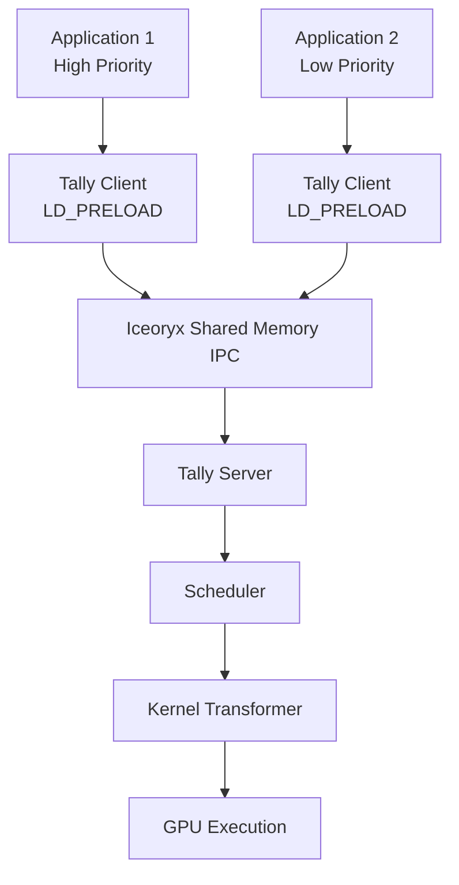

English version | [中文版](README_cn.md)

# Tally

**Non-Intrusive Performance Isolation for Concurrent Deep Learning Workloads on GPUs.**

[](LICENSE)
[](https://github.com/tally-project/tally/stargazers)
[](https://doi.org/10.1145/3669940.3707282)
[](https://arxiv.org/abs/2410.07381)

Tally is a non-intrusive GPU sharing mechanism that provides robust performance isolation and seamless workload compatibility. It employs **block-level GPU kernel scheduling** to mitigate interference from workload co-execution, ensuring high-priority tasks (e.g., real-time inference) can effectively maintain their performance when sharing GPUs with best-effort workloads (e.g., training).

Tally was published at **ASPLOS 2025** (The 30th ACM International Conference on Architectural Support for Programming Languages and Operating Systems).

## Why Tally?

Modern GPU clusters face critical challenges when multiple deep learning workloads share the same GPU:

- **Time-Slicing** introduces high context-switch overhead and provides no performance isolation between workloads.
- **NVIDIA MPS** enables spatial sharing but offers limited priority-aware scheduling and no preemption capability.
- **MIG** provides hardware-level isolation but requires expensive GPU partitioning and lacks flexibility.

Tally addresses these limitations with a unique approach:

- **Non-Intrusive**: Zero application code changes required. Tally intercepts CUDA API calls transparently via `LD_PRELOAD`.
- **Block-Level Scheduling**: Fine-grained control over GPU kernel execution at the thread-block level, enabling precise resource allocation.
- **Priority-Aware Isolation**: High-priority latency-sensitive workloads (inference) maintain their SLOs while sharing GPUs with best-effort workloads (training).
- **Low Overhead**: Kernel transformation and caching minimize runtime overhead for repeated kernel launches.
- **Multiple Scheduling Policies**: From simple pass-through to sophisticated workload-aware sharing, choose the policy that fits your scenario.

## Key Features

| Feature | Description |
| --- | --- |
| Non-intrusive GPU sharing | Transparent CUDA API interception via preload library |
| Block-level kernel scheduling | PTB (Persistent Thread Block) transformation for fine-grained control |
| Kernel slicing | Split large kernels into smaller sub-kernels for preemption |
| Priority-aware preemption | Interrupt low-priority kernels to guarantee high-priority latency |
| Workload-aware adaptation | Automatically select optimal scheduling strategy per kernel |
| Cubin caching | Cache transformed kernels to avoid repeated compilation |
| Multi-client support | Serve multiple GPU workloads simultaneously with priority ordering |

## How It Works

Tally uses a client-server architecture with zero-copy shared memory communication (Iceoryx):

```text
Application Process (Client)
  -> LD_PRELOAD tally_client.so
  -> CUDA API calls intercepted
  -> Serialized via Iceoryx shared memory
  -> Tally Server receives API requests
  -> Scheduler selects launch configuration
  -> Kernel transformation (PTB / Slicing)
  -> GPU execution with isolation
  -> Results returned to client
```



## Scheduling Policies

Tally supports five scheduling policies, configurable via the `SCHEDULER_POLICY` environment variable:

| Policy | Description | Use Case |
| --- | --- | --- |
| `NAIVE` | Direct pass-through, no scheduling | Baseline measurement, single-tenant |
| `PROFILE` | Collect per-kernel performance metrics | Performance characterization |
| `PRIORITY` | Priority-based time-sharing with preemption | Mixed inference + training workloads |
| `WORKLOAD_AGNOSTIC_SHARING` | PTB-based spatial sharing without workload knowledge | Simple multi-tenant sharing |
| `WORKLOAD_AWARE_SHARING` | Adaptive strategy selection based on kernel characteristics | Optimal multi-tenant performance |

The **PRIORITY** scheduler is the primary production policy, providing:
- Time-slice rotation between high and low priority kernels
- Preemptive PTB for fast interrupt of low-priority work
- Kernel slicing for large kernels that exceed preemption latency targets
- Optional spatial sharing across SM partitions

## Supported Workloads

Tally has been evaluated with diverse deep learning workloads:

**Inference (High Priority)**:
- BERT (ONNXRuntime)
- LLaMA-2-7B (ONNXRuntime)
- YOLOv6-M (PyTorch)
- GPT-Neo-2.7B (PyTorch)
- Stable Diffusion (PyTorch)
- ResNet-50 (Hidet)

**Training (Best-Effort)**:
- Whisper-Large-V3 (PyTorch)
- BERT (PyTorch)
- Pegasus-X-Base (PyTorch)
- ResNet-50 (PyTorch)
- PointNet (PyTorch)
- GPT-2-Large (PyTorch)

## Quick Start

### Prerequisites

- Linux x86-64 with NVIDIA GPU (Compute Capability 8.0+, e.g., A100)
- CUDA Toolkit 12.x
- NVIDIA Driver >= 525
- CMake >= 3.24
- C++20 compatible compiler (GCC >= 10)
- Boost libraries (serialization, regex, stacktrace)
- Folly library

### Option 1: Docker (Recommended)

```bash
# Pull the pre-built Docker image
docker pull wzhao18/tally:bench

# Launch container with GPU access
docker run -it --shm-size=64g --gpus all wzhao18/tally:bench /bin/bash
```

### Option 2: Build from Source

```bash
# Clone the repository
git clone --recursive https://github.com/tally-project/tally.git
cd tally

# Build NCCL and Tally
make build
```

This will:
1. Build the NCCL dependency
2. Create a `build/` directory with CMake
3. Compile `tally_server`, `tally_client.so`, and related libraries

### Running Tally

```bash
# Step 1: Start the Iceoryx RouDi middleware
./scripts/start_iox.sh

# Step 2: Start the Tally server with desired scheduling policy
SCHEDULER_POLICY=PRIORITY ./scripts/start_server.sh

# Step 3: Run your application with Tally client preload
./scripts/start_client.sh <your_command>
```

## Configuration

Tally is configured through environment variables set when launching the server:

### Core Configuration

| Variable | Default | Description |
| --- | --- | --- |
| `SCHEDULER_POLICY` | `NAIVE` | Scheduling policy (see table above) |
| `KERNEL_PROFILE_ITERATIONS` | `5` | Number of profiling iterations per kernel |

### Priority Scheduler Configuration

| Variable | Default | Description |
| --- | --- | --- |
| `PRIORITY_MAX_ALLOWED_PREEMPTION_LATENCY_MS` | `0.1` | Maximum acceptable preemption latency (ms) |
| `PRIORITY_MIN_WAIT_TIME_MS` | `0.1` | Minimum wait time before yielding to lower priority (ms) |
| `PRIORITY_PTB_MAX_NUM_THREADS_PER_SM` | `1024` | Max threads per SM for PTB kernels |
| `PRIORITY_MIN_WORKER_BLOCKS` | `24` | Minimum blocks for worker kernels |
| `PRIORITY_USE_ORIGINAL_CONFIGS` | `FALSE` | Fall back to original launch configs |
| `PRIORITY_USE_SPACE_SHARE` | `FALSE` | Enable spatial sharing across SM partitions |
| `PRIORITY_DISABLE_TRANSFORMATION` | `FALSE` | Disable kernel transformation |
| `PRIORITY_SPACE_SHARE_MAX_SM_PERCENTAGE` | `0.0` | Max SM percentage for space sharing |

### Sharing Scheduler Configuration

| Variable | Default | Description |
| --- | --- | --- |
| `SHARING_PTB_MAX_NUM_THREADS_PER_SM` | `1024` | Max threads per SM for sharing PTB |
| `SHARING_USE_PTB_THRESHOLD` | `0.9` | Threshold to trigger PTB transformation |

## Architecture

```
tally/
├── src/tally/
│   ├── server.cpp              # Multi-client server with Iceoryx IPC
│   ├── transform.cpp           # PTX kernel transformation engine
│   ├── partial.cpp             # Partial execution framework
│   ├── cuda_launch.cpp         # Launch configuration management
│   ├── cache.cpp               # Cubin transformation cache
│   ├── cuda_util.cpp           # CUDA device utilities
│   ├── env.cpp                 # Environment configuration
│   ├── scheduler/
│   │   ├── priority.cpp        # Priority-based preemptive scheduler
│   │   ├── workload_aware.cpp  # Workload-aware adaptive scheduler
│   │   ├── workload_agnostic.cpp # Simple PTB sharing scheduler
│   │   ├── profile.cpp         # Performance profiling scheduler
│   │   └── naive.cpp           # Pass-through scheduler
│   └── preload/
│       └── tally_client.cpp    # Client preload library (CUDA API hooks)
├── include/tally/              # Public headers
├── python/tally/               # Code generation tools
│   ├── preload/                # Client preload code generator
│   └── transform/              # PTB/Slice transformation tools
├── scripts/                    # Build and runtime scripts
├── config/                     # Iceoryx RouDi configuration
├── tests/                      # Test suite
└── CMakeLists.txt              # Build configuration
```

## Benchmarks

Benchmark scripts for reproducing the results from our ASPLOS 2025 paper are available in the [tally-bench](https://github.com/tally-project/tally-bench) repository.

Key evaluation results demonstrate that Tally:
- Achieves **< 5% overhead** for single-job API forwarding
- Provides **up to 96% latency reduction** for high-priority inference under co-location
- Outperforms MPS Priority and Time-Slicing across all tested workload pairs

## Citation

If you use Tally in your research, please cite our paper:

```bibtex
@inproceedings{10.1145/3669940.3707282,
    author = {Zhao, Wei and Jayarajan, Anand and Pekhimenko, Gennady},
    title = {Tally: Non-Intrusive Performance Isolation for Concurrent Deep Learning Workloads},
    year = {2025},
    isbn = {9798400706981},
    publisher = {Association for Computing Machinery},
    address = {New York, NY, USA},
    url = {https://doi.org/10.1145/3669940.3707282},
    doi = {10.1145/3669940.3707282},
    booktitle = {Proceedings of the 30th ACM International Conference on Architectural Support for Programming Languages and Operating Systems, Volume 1},
    pages = {1052--1068},
    location = {Rotterdam, Netherlands},
    series = {ASPLOS '25}
}
```

## Contributing

We welcome contributions! Please see [docs/develop/contributing.md](docs/develop/contributing.md) for guidelines.

## License

Tally is licensed under the MIT License. See [LICENSE](LICENSE) for details.

Copyright (c) 2024 tally-project.
