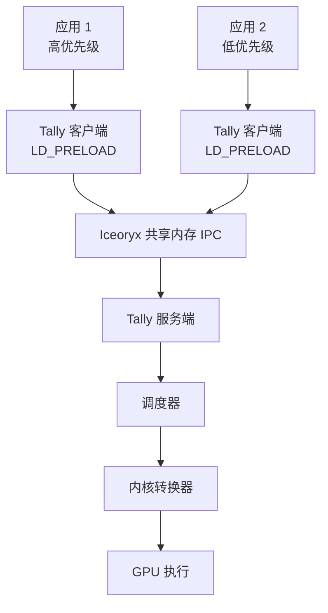

[English version](README.md) | 中文版

# Tally

**面向 GPU 上并发深度学习工作负载的非侵入式性能隔离机制。**

[](LICENSE)
[](https://github.com/tally-project/tally/stargazers)
[](https://doi.org/10.1145/3669940.3707282)
[](https://arxiv.org/abs/2410.07381)

Tally 是一种非侵入式 GPU 共享机制，提供强健的性能隔离和无缝的工作负载兼容性。它采用**块级 GPU 内核调度**来减轻工作负载并发执行时的干扰，确保高优先级任务（如实时推理）在与尽力而为工作负载（如训练）共享 GPU 时能有效维持其性能。

Tally 发表于 **ASPLOS 2025**（第 30 届 ACM 编程语言与操作系统体系结构支持国际会议）。

## 为什么选择 Tally？

现代 GPU 集群在多个深度学习工作负载共享同一 GPU 时面临关键挑战：

- **时间片轮转（Time-Slicing）**引入了高上下文切换开销，且无法在工作负载间提供性能隔离。
- **NVIDIA MPS** 支持空间共享，但优先级感知调度有限，且不具备抢占能力。
- **MIG** 提供硬件级隔离，但需要昂贵的 GPU 分区，且缺乏灵活性。

Tally 以独特的方式解决这些局限性：

- **非侵入式**：无需修改任何应用代码。Tally 通过 `LD_PRELOAD` 透明拦截 CUDA API 调用。
- **块级调度**：在线程块级别对 GPU 内核执行进行细粒度控制，实现精确的资源分配。
- **优先级感知隔离**：高优先级延迟敏感型工作负载（推理）在与尽力而为工作负载（训练）共享 GPU 时维持其 SLO。
- **低开销**：内核转换和缓存机制最小化了重复内核启动的运行时开销。
- **多种调度策略**：从简单的直通到复杂的工作负载感知共享，选择适合您场景的策略。

## 核心特性

| 特性 | 描述 |
| --- | --- |
| 非侵入式 GPU 共享 | 通过预加载库透明拦截 CUDA API |
| 块级内核调度 | PTB（持久线程块）转换实现细粒度控制 |
| 内核切片 | 将大型内核拆分为较小的子内核以支持抢占 |
| 优先级感知抢占 | 中断低优先级内核以保证高优先级延迟 |
| 工作负载感知适配 | 自动为每个内核选择最优调度策略 |
| Cubin 缓存 | 缓存转换后的内核以避免重复编译 |
| 多客户端支持 | 同时服务多个 GPU 工作负载并按优先级排序 |

## 工作原理

Tally 采用客户端-服务端架构，使用零拷贝共享内存通信（Iceoryx）：

```text
应用进程（客户端）
  -> LD_PRELOAD tally_client.so
  -> CUDA API 调用被拦截
  -> 通过 Iceoryx 共享内存序列化
  -> Tally 服务端接收 API 请求
  -> 调度器选择启动配置
  -> 内核转换（PTB / 切片）
  -> GPU 执行（带隔离）
  -> 结果返回给客户端
```



## 调度策略

Tally 支持五种调度策略，可通过 `SCHEDULER_POLICY` 环境变量配置：

| 策略 | 描述 | 使用场景 |
| --- | --- | --- |
| `NAIVE` | 直接透传，不进行调度 | 基线测量、单租户 |
| `PROFILE` | 收集每个内核的性能指标 | 性能特征分析 |
| `PRIORITY` | 基于优先级的时间共享与抢占 | 推理+训练混合工作负载 |
| `WORKLOAD_AGNOSTIC_SHARING` | 基于 PTB 的空间共享，无需工作负载知识 | 简单多租户共享 |
| `WORKLOAD_AWARE_SHARING` | 基于内核特征的自适应策略选择 | 最优多租户性能 |

**PRIORITY** 调度器是主要的生产策略，提供：
- 高低优先级内核间的时间片轮转
- 抢占式 PTB 实现低优先级工作的快速中断
- 对超过抢占延迟目标的大型内核进行切片
- 可选的跨 SM 分区空间共享

## 支持的工作负载

Tally 已使用多种深度学习工作负载进行评估：

**推理（高优先级）**：
- BERT (ONNXRuntime)
- LLaMA-2-7B (ONNXRuntime)
- YOLOv6-M (PyTorch)
- GPT-Neo-2.7B (PyTorch)
- Stable Diffusion (PyTorch)
- ResNet-50 (Hidet)

**训练（尽力而为）**：
- Whisper-Large-V3 (PyTorch)
- BERT (PyTorch)
- Pegasus-X-Base (PyTorch)
- ResNet-50 (PyTorch)
- PointNet (PyTorch)
- GPT-2-Large (PyTorch)

## 快速开始

### 前置条件

- Linux x86-64 + NVIDIA GPU（计算能力 8.0+，如 A100）
- CUDA Toolkit 12.x
- NVIDIA 驱动 >= 525
- CMake >= 3.24
- 支持 C++20 的编译器（GCC >= 10）
- Boost 库（serialization、regex、stacktrace）
- Folly 库

### 方式一：Docker（推荐）

```bash
# 拉取预构建的 Docker 镜像
docker pull wzhao18/tally:bench

# 启动容器并挂载 GPU
docker run -it --shm-size=64g --gpus all wzhao18/tally:bench /bin/bash
```

### 方式二：从源码编译

```bash
# 克隆仓库
git clone --recursive https://github.com/tally-project/tally.git
cd tally

# 编译 NCCL 和 Tally
make build
```

这将会：
1. 编译 NCCL 依赖
2. 创建 `build/` 目录并使用 CMake 配置
3. 编译 `tally_server`、`tally_client.so` 及相关库

### 运行 Tally

```bash
# 步骤 1：启动 Iceoryx RouDi 中间件
./scripts/start_iox.sh

# 步骤 2：以指定调度策略启动 Tally 服务端
SCHEDULER_POLICY=PRIORITY ./scripts/start_server.sh

# 步骤 3：使用 Tally 客户端预加载运行您的应用
./scripts/start_client.sh <your_command>
```

## 配置

Tally 通过启动服务端时设置的环境变量进行配置：

### 核心配置

| 变量 | 默认值 | 描述 |
| --- | --- | --- |
| `SCHEDULER_POLICY` | `NAIVE` | 调度策略（参见上表） |
| `KERNEL_PROFILE_ITERATIONS` | `5` | 每个内核的性能分析迭代次数 |

### 优先级调度器配置

| 变量 | 默认值 | 描述 |
| --- | --- | --- |
| `PRIORITY_MAX_ALLOWED_PREEMPTION_LATENCY_MS` | `0.1` | 最大可接受的抢占延迟（毫秒） |
| `PRIORITY_MIN_WAIT_TIME_MS` | `0.1` | 让步给低优先级前的最小等待时间（毫秒） |
| `PRIORITY_PTB_MAX_NUM_THREADS_PER_SM` | `1024` | PTB 内核每个 SM 的最大线程数 |
| `PRIORITY_MIN_WORKER_BLOCKS` | `24` | 工作内核的最小块数 |
| `PRIORITY_USE_ORIGINAL_CONFIGS` | `FALSE` | 回退到原始启动配置 |
| `PRIORITY_USE_SPACE_SHARE` | `FALSE` | 启用跨 SM 分区的空间共享 |
| `PRIORITY_DISABLE_TRANSFORMATION` | `FALSE` | 禁用内核转换 |
| `PRIORITY_SPACE_SHARE_MAX_SM_PERCENTAGE` | `0.0` | 空间共享的最大 SM 百分比 |

### 共享调度器配置

| 变量 | 默认值 | 描述 |
| --- | --- | --- |
| `SHARING_PTB_MAX_NUM_THREADS_PER_SM` | `1024` | 共享 PTB 每个 SM 的最大线程数 |
| `SHARING_USE_PTB_THRESHOLD` | `0.9` | 触发 PTB 转换的阈值 |

## 项目结构

```
tally/
├── src/tally/
│   ├── server.cpp              # 基于 Iceoryx IPC 的多客户端服务端
│   ├── transform.cpp           # PTX 内核转换引擎
│   ├── partial.cpp             # 部分执行框架
│   ├── cuda_launch.cpp         # 启动配置管理
│   ├── cache.cpp               # Cubin 转换缓存
│   ├── cuda_util.cpp           # CUDA 设备工具
│   ├── env.cpp                 # 环境配置
│   ├── scheduler/
│   │   ├── priority.cpp        # 基于优先级的抢占式调度器
│   │   ├── workload_aware.cpp  # 工作负载感知自适应调度器
│   │   ├── workload_agnostic.cpp # 简单 PTB 共享调度器
│   │   ├── profile.cpp         # 性能分析调度器
│   │   └── naive.cpp           # 直通调度器
│   └── preload/
│       └── tally_client.cpp    # 客户端预加载库（CUDA API 钩子）
├── include/tally/              # 公共头文件
├── python/tally/               # 代码生成工具
│   ├── preload/                # 客户端预加载代码生成器
│   └── transform/              # PTB/切片转换工具
├── scripts/                    # 构建和运行脚本
├── config/                     # Iceoryx RouDi 配置
├── tests/                      # 测试套件
└── CMakeLists.txt              # 构建配置
```

## 基准测试

论文结果的复现脚本请参见 [tally-bench](https://github.com/tally-project/tally-bench) 仓库。

关键评估结果表明 Tally：
- 单任务 API 转发开销 **< 5%**
- 在混合部署场景下为高优先级推理提供 **最高 96% 的延迟降低**
- 在所有测试的工作负载组合中均优于 MPS Priority 和 Time-Slicing

## 引用

如果您在研究中使用了 Tally，请引用我们的论文：

```bibtex
@inproceedings{10.1145/3669940.3707282,
    author = {Zhao, Wei and Jayarajan, Anand and Pekhimenko, Gennady},
    title = {Tally: Non-Intrusive Performance Isolation for Concurrent Deep Learning Workloads},
    year = {2025},
    isbn = {9798400706981},
    publisher = {Association for Computing Machinery},
    address = {New York, NY, USA},
    url = {https://doi.org/10.1145/3669940.3707282},
    doi = {10.1145/3669940.3707282},
    booktitle = {Proceedings of the 30th ACM International Conference on Architectural Support for Programming Languages and Operating Systems, Volume 1},
    pages = {1052--1068},
    location = {Rotterdam, Netherlands},
    series = {ASPLOS '25}
}
```

## 贡献

欢迎贡献！请参阅 [docs/develop/contributing.md](docs/develop/contributing.md) 了解贡献指南。

## 许可证

Tally 采用 MIT 许可证。详见 [LICENSE](LICENSE)。

Copyright (c) 2024 tally-project.
