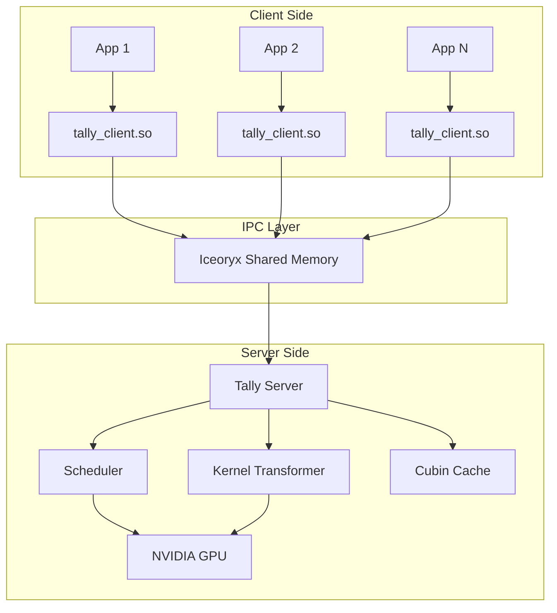
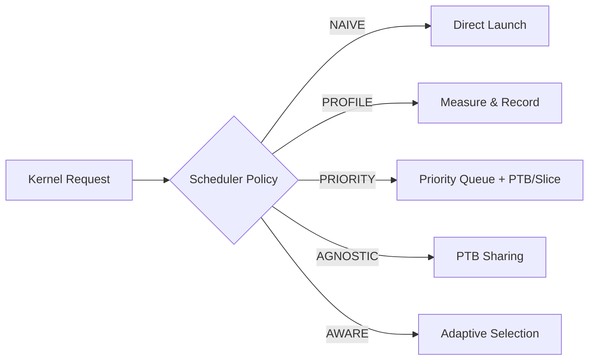
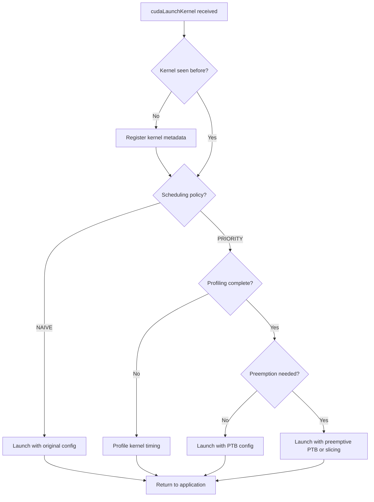

# Tally Architecture

This document provides a detailed overview of Tally's architecture, covering the system's core components, communication model, and kernel transformation pipeline.

## System Overview

Tally employs a **client-server architecture** that transparently interposes between GPU applications and the CUDA runtime. The server acts as a centralized GPU resource manager, while clients are thin interception layers loaded into application processes.



## Core Components

### 1. Client Preload Library (`tally_client.so`)

The client library is injected into application processes via `LD_PRELOAD`. It:

- **Intercepts all CUDA API calls** by replacing standard library symbols (cudaMalloc, cudaLaunchKernel, cuBLAS, cuDNN, NCCL, etc.)
- **Serializes API call parameters** into compact message structures
- **Communicates with the server** through Iceoryx zero-copy shared memory IPC
- **Returns results** to the application as if the call was executed locally

Key design decisions:
- Uses `dlsym(RTLD_NEXT, ...)` to resolve original CUDA symbols
- Supports CUDA Runtime API, CUDA Driver API, cuBLAS, cuBLASLt, cuDNN, NCCL, cuRAND, cuSPARSE
- Client priority is established during handshake with the server

### 2. Tally Server (`tally_server`)

The server is the central orchestrator that:

- **Manages client connections** through a handshake protocol (client ID + priority assignment)
- **Spawns worker threads** for each connected client
- **Routes API calls** to the appropriate handler (direct execution, scheduled execution, or transformed execution)
- **Tracks GPU memory allocations** per client and cleans up on client exit
- **Coordinates scheduling** across all active clients

Server lifecycle:
```text
1. Initialize Iceoryx runtime
2. Create handshake server channel
3. Initialize CUDA context
4. Main loop:
   a. Accept new client handshakes
   b. Create per-client worker thread
   c. Monitor and clean up exited clients
5. On shutdown: save transformation cache
```

### 3. Kernel Transformer

The transformer modifies CUDA kernels at the PTX level to enable fine-grained scheduling:

**Sync-Aware Transformation:**
- Analyzes PTX code for `bar.sync` (barrier synchronization) and `ret` (return) instructions
- Inserts control flow to ensure all threads reach sync points together
- Prevents deadlocks when only a subset of thread blocks are launched

**PTB (Persistent Thread Block) Transformation:**
- Rewrites kernels to use a global index counter for work distribution
- Allows launching fewer blocks than the original configuration
- Enables dynamic and preemptive variants for runtime control

**Kernel Slicing:**
- Splits a kernel's grid into multiple sub-grids
- Each slice can be launched independently
- Enables fine-grained preemption at slice boundaries

### 4. Scheduler Framework

The scheduler determines how and when to launch GPU kernels:



Each scheduler implements the core dispatch loop differently:
- **Naive**: Immediately forwards kernels to GPU
- **Profile**: Executes kernels multiple times to collect timing data
- **Priority**: Maintains priority queues, uses PTB/preemption for isolation
- **Workload Agnostic**: Applies PTB to limit SM occupancy per client
- **Workload Aware**: Combines profiling data with runtime heuristics

### 5. Cubin Cache

To avoid the overhead of repeated kernel transformations:

- Transformed cubins are stored in `~/.cache/tally/transform/`
- Cache is keyed by cubin binary content and size
- On server startup, cache is loaded from disk
- On server shutdown, new transformations are persisted
- Cache supports concurrent read access with shared locks

## Communication Model

### Iceoryx IPC

Tally uses [Eclipse Iceoryx](https://iceoryx.io/) for inter-process communication:

- **Zero-copy**: Data is placed directly in shared memory without serialization overhead for large payloads
- **Request-Response pattern**: Client sends API request, server processes and responds
- **RouDi middleware**: A daemon process manages shared memory segments
- **Configurable memory pools**: Different pool sizes for different message types (128B to 3GB)

### Message Protocol

```text
┌─────────────────────────────────────────┐
│ MessageHeader                            │
│   - api_id: CUDA_API_ENUM               │
│   - client_id: int32_t                  │
├─────────────────────────────────────────┤
│ API-specific argument struct             │
│   (e.g., cudaLaunchKernelArg)           │
│   - host_func, gridDim, blockDim, etc.  │
│   - Variable-length data[] for params   │
└─────────────────────────────────────────┘
```

### Client Lifecycle

1. **Handshake**: Client sends `HandshakeMessage` with client_id and priority
2. **Channel Setup**: Server creates a dedicated communication channel
3. **API Forwarding**: Client serializes calls, server executes and responds
4. **Cleanup**: On client exit, server frees allocated GPU memory

## Kernel Launch Pipeline

When a `cudaLaunchKernel` call arrives at the server:



## Build Targets

| Target | Type | Description |
| --- | --- | --- |
| `tally` | Static library | Core utilities, cache, transform, IPC |
| `tally_client` | Shared library | Client preload for remote execution |
| `tally_client_local` | Shared library | Client preload for local execution |
| `tally_server` | Executable | Server process |
| `tally_cutlass` | Shared library | CUTLASS kernel integration |

## Dependencies

| Library | Purpose |
| --- | --- |
| CUDA 12.x | GPU runtime and compiler |
| Iceoryx | Zero-copy shared memory IPC |
| Boost | Serialization, regex, stack traces |
| Folly | Concurrent data structures |
| SPDlog | High-performance logging |
| nlohmann/json | JSON serialization |
| NCCL | Multi-GPU communication |
| CUTLASS | Matrix multiplication kernels |
