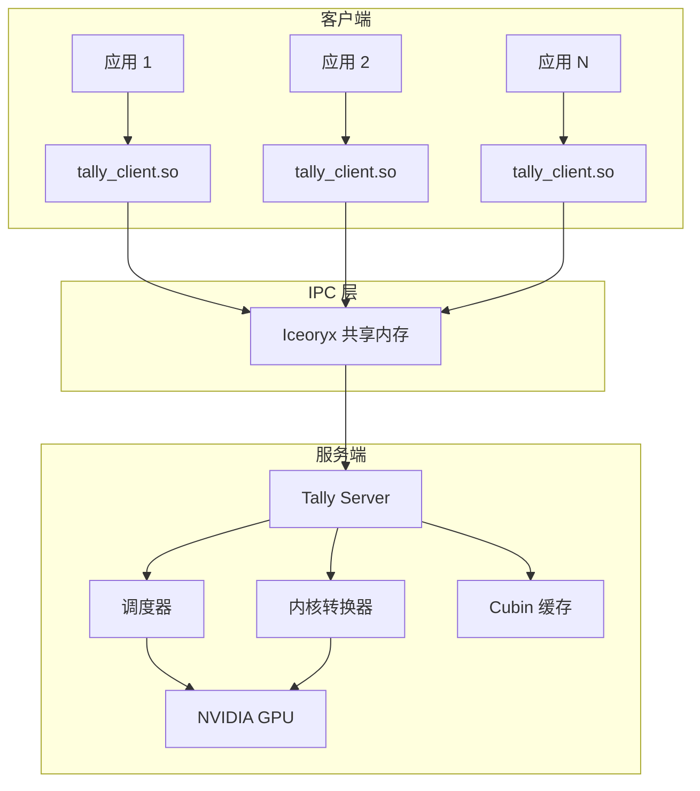
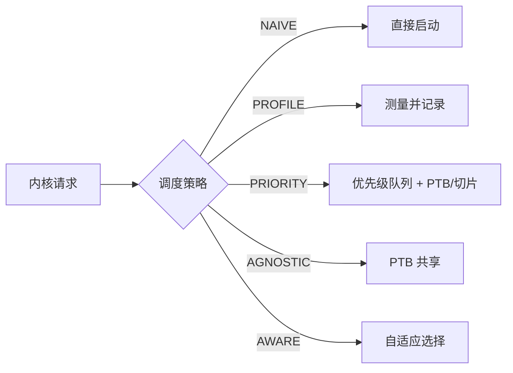
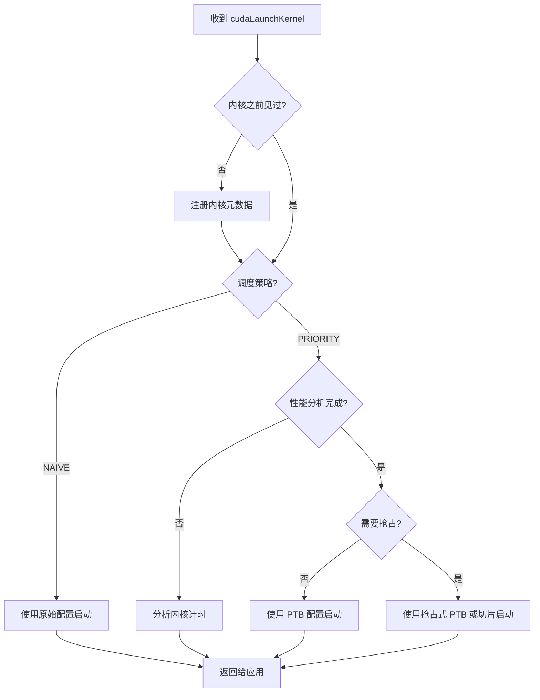

# Tally 架构设计

本文档详细介绍 Tally 的系统架构，涵盖核心组件、通信模型和内核转换流水线。

## 系统概述

Tally 采用**客户端-服务端架构**，透明地介入 GPU 应用与 CUDA 运行时之间。服务端作为集中式 GPU 资源管理器，而客户端是加载到应用进程中的轻量拦截层。



## 核心组件

### 1. 客户端预加载库 (`tally_client.so`)

客户端库通过 `LD_PRELOAD` 注入到应用进程中。它：

- **拦截所有 CUDA API 调用**：替换标准库符号（cudaMalloc、cudaLaunchKernel、cuBLAS、cuDNN、NCCL 等）
- **序列化 API 调用参数**：封装为紧凑的消息结构体
- **与服务端通信**：通过 Iceoryx 零拷贝共享内存 IPC
- **返回结果**：如同调用在本地执行一样返回给应用

关键设计决策：
- 使用 `dlsym(RTLD_NEXT, ...)` 解析原始 CUDA 符号
- 支持 CUDA Runtime API、CUDA Driver API、cuBLAS、cuBLASLt、cuDNN、NCCL、cuRAND、cuSPARSE
- 客户端优先级在与服务端握手时确立

### 2. Tally 服务端 (`tally_server`)

服务端是核心编排器，负责：

- **管理客户端连接**：通过握手协议（客户端 ID + 优先级分配）
- **为每个客户端创建工作线程**
- **路由 API 调用**：到合适的处理器（直接执行、调度执行或转换执行）
- **跟踪每个客户端的 GPU 内存分配**：在客户端退出时清理
- **协调所有活跃客户端的调度**

服务端生命周期：
```text
1. 初始化 Iceoryx 运行时
2. 创建握手服务端通道
3. 初始化 CUDA 上下文
4. 主循环：
   a. 接受新客户端握手
   b. 创建每客户端工作线程
   c. 监控并清理已退出的客户端
5. 关闭时：保存转换缓存
```

### 3. 内核转换器

转换器在 PTX 级别修改 CUDA 内核以支持细粒度调度：

**同步感知转换：**
- 分析 PTX 代码中的 `bar.sync`（屏障同步）和 `ret`（返回）指令
- 插入控制流以确保所有线程同时到达同步点
- 防止仅启动部分线程块时的死锁

**PTB（持久线程块）转换：**
- 重写内核使用全局索引计数器进行工作分配
- 允许启动比原始配置更少的线程块
- 支持动态和抢占式变体以实现运行时控制

**内核切片：**
- 将内核的网格拆分为多个子网格
- 每个切片可以独立启动
- 在切片边界处实现细粒度抢占

### 4. 调度器框架

调度器决定如何以及何时启动 GPU 内核：



各调度器实现不同的核心分发循环：
- **Naive**：立即将内核转发到 GPU
- **Profile**：多次执行内核以收集计时数据
- **Priority**：维护优先级队列，使用 PTB/抢占实现隔离
- **Workload Agnostic**：应用 PTB 限制每个客户端的 SM 占用率
- **Workload Aware**：结合性能分析数据和运行时启发式方法

### 5. Cubin 缓存

为避免重复内核转换的开销：

- 转换后的 cubin 存储在 `~/.cache/tally/transform/` 中
- 缓存以 cubin 二进制内容和大小为键
- 服务端启动时从磁盘加载缓存
- 服务端关闭时持久化新的转换结果
- 缓存支持共享锁的并发读取

## 通信模型

### Iceoryx IPC

Tally 使用 [Eclipse Iceoryx](https://iceoryx.io/) 进行进程间通信：

- **零拷贝**：数据直接放置在共享内存中，大载荷无需序列化开销
- **请求-响应模式**：客户端发送 API 请求，服务端处理并响应
- **RouDi 中间件**：守护进程管理共享内存段
- **可配置内存池**：针对不同消息类型配置不同大小的池（128B 到 3GB）

### 消息协议

```text
┌─────────────────────────────────────────┐
│ MessageHeader                            │
│   - api_id: CUDA_API_ENUM               │
│   - client_id: int32_t                  │
├─────────────────────────────────────────┤
│ API 特定参数结构体                        │
│   (例如 cudaLaunchKernelArg)             │
│   - host_func, gridDim, blockDim 等      │
│   - 可变长度 data[] 用于参数传递          │
└─────────────────────────────────────────┘
```

### 客户端生命周期

1. **握手**：客户端发送 `HandshakeMessage`，包含 client_id 和优先级
2. **通道建立**：服务端创建专用通信通道
3. **API 转发**：客户端序列化调用，服务端执行并响应
4. **清理**：客户端退出时，服务端释放已分配的 GPU 内存

## 内核启动流水线

当 `cudaLaunchKernel` 调用到达服务端时：



## 构建目标

| 目标 | 类型 | 描述 |
| --- | --- | --- |
| `tally` | 静态库 | 核心工具、缓存、转换、IPC |
| `tally_client` | 共享库 | 远程执行的客户端预加载 |
| `tally_client_local` | 共享库 | 本地执行的客户端预加载 |
| `tally_server` | 可执行文件 | 服务端进程 |
| `tally_cutlass` | 共享库 | CUTLASS 内核集成 |

## 依赖项

| 库 | 用途 |
| --- | --- |
| CUDA 12.x | GPU 运行时和编译器 |
| Iceoryx | 零拷贝共享内存 IPC |
| Boost | 序列化、正则表达式、堆栈跟踪 |
| Folly | 并发数据结构 |
| SPDlog | 高性能日志 |
| nlohmann/json | JSON 序列化 |
| NCCL | 多 GPU 通信 |
| CUTLASS | 矩阵乘法内核 |
