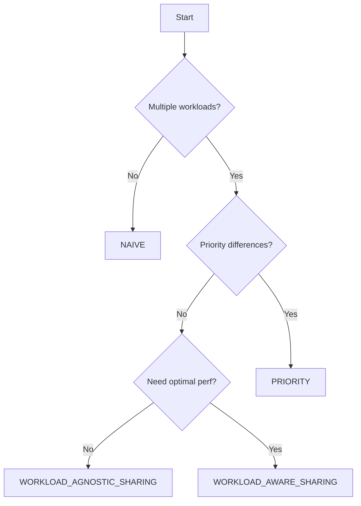

# Scheduling Policies

Tally provides five scheduling policies for GPU kernel management. Each policy is suited for different deployment scenarios.

## Policy Overview

| Policy | Preemption | Profiling | Multi-tenant | Best For |
| --- | --- | --- | --- | --- |
| NAIVE | No | No | No | Single-tenant, baseline |
| PROFILE | No | Yes | No | Performance characterization |
| PRIORITY | Yes | Yes | Yes | Production mixed workloads |
| WORKLOAD_AGNOSTIC_SHARING | No | No | Yes | Simple spatial sharing |
| WORKLOAD_AWARE_SHARING | Partial | Yes | Yes | Optimal multi-tenant |

## NAIVE

The simplest policy that directly forwards all kernel launches to the GPU without any modification.

**Behavior:**
- All CUDA API calls are forwarded to the real GPU driver
- No kernel transformation is applied
- No scheduling decisions are made

**Use when:**
- Running a single workload through Tally (to measure API forwarding overhead)
- Debugging Tally's interception layer
- Baseline performance measurement

## PROFILE

Collects per-kernel performance metrics for all launch configurations.

**Behavior:**
- Each unique kernel (identified by function pointer + grid/block dimensions) is profiled
- Multiple launch configurations are tested: original, PTB, dynamic PTB, preemptive PTB, and sliced
- Results are stored for use by other schedulers

**Profiling configurations tested:**
- Original launch (baseline)
- PTB with varying `blocks_per_sm` (1, 2, 3, ...)
- Dynamic PTB (runtime adjustable)
- Preemptive PTB (supports interruption)
- Kernel slicing (grid subdivision)

**Use when:**
- Characterizing workload kernel behavior
- Generating performance data for offline analysis
- Preparing cache for PRIORITY scheduler

## PRIORITY

The primary production policy for mixed inference + training deployments.

**Behavior:**
1. Clients connect with assigned priorities (higher number = higher priority)
2. High-priority kernels are launched immediately
3. Low-priority kernels run in remaining GPU cycles
4. When a high-priority kernel arrives during low-priority execution:
   - If the low-priority kernel uses preemptive PTB: signal retreat
   - If the low-priority kernel uses kernel slicing: wait for current slice to finish
   - Otherwise: wait for current kernel to complete

**Key mechanisms:**

### PTB-based Preemption

For kernels that fit within the PTB framework:
- Low-priority kernels are launched with a `retreat` flag in shared memory
- When preemption is needed, the server sets the retreat flag
- The running kernel checks the flag and exits early
- Preemption latency depends on kernel granularity

### Kernel Slicing

For large kernels where PTB preemption latency would be too high:
- The kernel grid is divided into N slices
- Each slice is launched independently
- Preemption occurs at slice boundaries
- Maximum preemption latency = time of one slice

### Spatial Sharing

When `PRIORITY_USE_SPACE_SHARE=TRUE`:
- High and low priority kernels can execute simultaneously on different SMs
- SM partitioning is controlled by `PRIORITY_SPACE_SHARE_MAX_SM_PERCENTAGE`

**Configuration:**

```bash
SCHEDULER_POLICY=PRIORITY \
PRIORITY_MAX_ALLOWED_PREEMPTION_LATENCY_MS=0.1 \
PRIORITY_MIN_WAIT_TIME_MS=0.1 \
./scripts/start_server.sh
```

## WORKLOAD_AGNOSTIC_SHARING

Spatial sharing without requiring workload knowledge.

**Behavior:**
- All kernels are launched with PTB transformation
- Each kernel is limited to a fixed number of thread blocks per SM
- This naturally leaves SM resources for other co-running workloads
- No priority ordering between clients

**Throttling logic:**
- If a kernel's `threads_per_sm` exceeds `SHARING_PTB_MAX_NUM_THREADS_PER_SM`:
  - Apply PTB transformation with the largest feasible `blocks_per_sm`
  - Or apply dynamic PTB / kernel slicing as alternatives
- Small kernels that already fit within limits are not transformed

**Use when:**
- Multiple equal-priority workloads sharing a GPU
- Simple multi-tenant scenarios without strict SLO requirements

## WORKLOAD_AWARE_SHARING

Adaptive strategy that combines profiling data with runtime decisions.

**Behavior:**
- Profiles each kernel's performance under different configurations
- Selects the optimal strategy per kernel based on measured data
- Combines PTB, preemptive PTB, and original launch configs
- Adapts to changing workload characteristics at runtime

**Use when:**
- You want the best possible multi-tenant performance
- Workloads have diverse kernel characteristics
- Willing to accept initial profiling overhead

## Selecting a Policy



**Recommended defaults:**
- Single workload: `NAIVE`
- Mixed inference + training: `PRIORITY`
- Equal-priority multi-tenant: `WORKLOAD_AGNOSTIC_SHARING`
