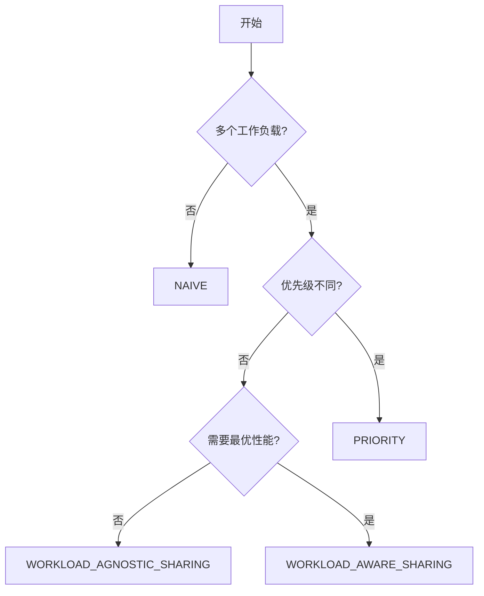

# 调度策略

Tally 提供五种 GPU 内核管理调度策略，每种策略适用于不同的部署场景。

## 策略概览

| 策略 | 支持抢占 | 性能分析 | 多租户 | 最适场景 |
| --- | --- | --- | --- | --- |
| NAIVE | 否 | 否 | 否 | 单租户、基线测量 |
| PROFILE | 否 | 是 | 否 | 性能特征分析 |
| PRIORITY | 是 | 是 | 是 | 生产环境混合工作负载 |
| WORKLOAD_AGNOSTIC_SHARING | 否 | 否 | 是 | 简单空间共享 |
| WORKLOAD_AWARE_SHARING | 部分 | 是 | 是 | 最优多租户性能 |

## NAIVE

最简单的策略，直接将所有内核启动转发到 GPU，不做任何修改。

**行为：**
- 所有 CUDA API 调用直接转发到真实 GPU 驱动
- 不应用内核转换
- 不做调度决策

**适用场景：**
- 单工作负载通过 Tally 运行（测量 API 转发开销）
- 调试 Tally 的拦截层
- 基线性能测量

## PROFILE

收集所有启动配置下每个内核的性能指标。

**行为：**
- 每个唯一内核（通过函数指针 + 网格/块维度标识）都被分析
- 测试多种启动配置：原始、PTB、动态 PTB、抢占式 PTB 和切片
- 结果存储供其他调度器使用

**测试的分析配置：**
- 原始启动（基线）
- 不同 `blocks_per_sm`（1、2、3...）的 PTB
- 动态 PTB（运行时可调）
- 抢占式 PTB（支持中断）
- 内核切片（网格细分）

**适用场景：**
- 分析工作负载内核行为特征
- 为离线分析生成性能数据
- 为 PRIORITY 调度器准备缓存

## PRIORITY

用于混合推理+训练部署的主要生产策略。

**行为：**
1. 客户端以分配的优先级连接（数字越大优先级越高）
2. 高优先级内核立即启动
3. 低优先级内核在剩余 GPU 周期中运行
4. 当高优先级内核在低优先级执行期间到达时：
   - 如果低优先级内核使用抢占式 PTB：发出撤退信号
   - 如果低优先级内核使用内核切片：等待当前切片完成
   - 否则：等待当前内核完成

**关键机制：**

### 基于 PTB 的抢占

对于适用 PTB 框架的内核：
- 低优先级内核启动时在共享内存中设置 `retreat` 标志
- 需要抢占时，服务端设置 retreat 标志
- 运行中的内核检查标志并提前退出
- 抢占延迟取决于内核粒度

### 内核切片

对于 PTB 抢占延迟过高的大型内核：
- 内核网格被分为 N 个切片
- 每个切片独立启动
- 抢占发生在切片边界
- 最大抢占延迟 = 一个切片的执行时间

### 空间共享

当 `PRIORITY_USE_SPACE_SHARE=TRUE` 时：
- 高低优先级内核可以在不同 SM 上同时执行
- SM 分区由 `PRIORITY_SPACE_SHARE_MAX_SM_PERCENTAGE` 控制

**配置示例：**

```bash
SCHEDULER_POLICY=PRIORITY \
PRIORITY_MAX_ALLOWED_PREEMPTION_LATENCY_MS=0.1 \
PRIORITY_MIN_WAIT_TIME_MS=0.1 \
./scripts/start_server.sh
```

## WORKLOAD_AGNOSTIC_SHARING

无需工作负载知识的空间共享。

**行为：**
- 所有内核以 PTB 转换启动
- 每个内核被限制为每个 SM 固定数量的线程块
- 这自然为其他并发工作负载留出 SM 资源
- 客户端之间无优先级排序

**限流逻辑：**
- 如果内核的 `threads_per_sm` 超过 `SHARING_PTB_MAX_NUM_THREADS_PER_SM`：
  - 使用最大可行的 `blocks_per_sm` 应用 PTB 转换
  - 或应用动态 PTB / 内核切片作为替代方案
- 已经在限制范围内的小内核不做转换

**适用场景：**
- 多个同等优先级的工作负载共享 GPU
- 无严格 SLO 要求的简单多租户场景

## WORKLOAD_AWARE_SHARING

结合性能分析数据和运行时决策的自适应策略。

**行为：**
- 在不同配置下分析每个内核的性能
- 基于测量数据为每个内核选择最优策略
- 组合 PTB、抢占式 PTB 和原始启动配置
- 在运行时适应变化的工作负载特征

**适用场景：**
- 期望最佳多租户性能
- 工作负载具有多样化的内核特征
- 可以接受初始性能分析开销

## 选择策略



**推荐默认值：**
- 单工作负载：`NAIVE`
- 混合推理+训练：`PRIORITY`
- 同等优先级多租户：`WORKLOAD_AGNOSTIC_SHARING`
